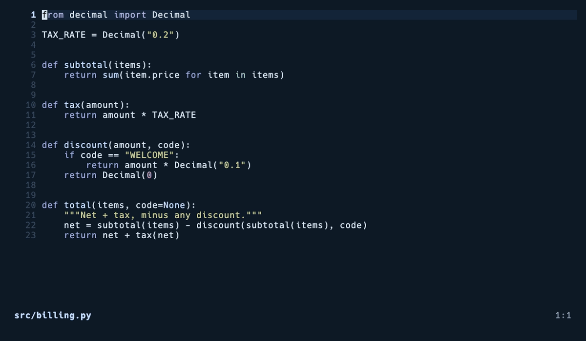
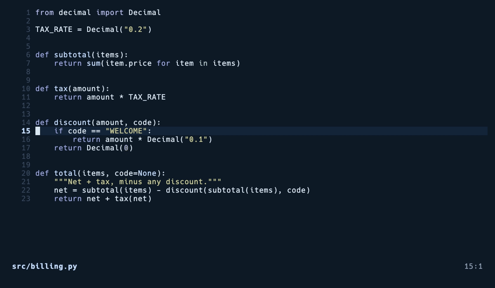
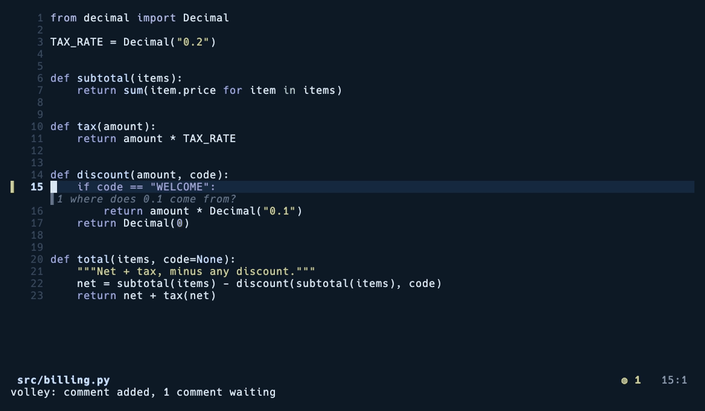
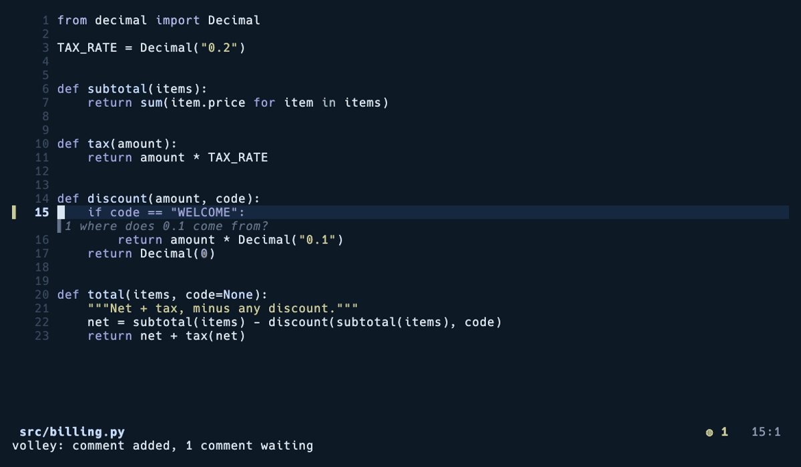

# volley.nvim

Review what your AI agent changed, comment on the lines, send it all back.



Claude, Codex or Copilot writes across half a dozen files while you are looking
somewhere else. volley shows you the list, the edits next to it, and lets you
write a note on any line. When you are ready, every note goes back to the agent
in one message.

It is code review for the thing sitting in your other tmux pane.

## Install

With [lazy.nvim](https://github.com/folke/lazy.nvim)

```lua
{ "skhan75/volley.nvim", event = "VeryLazy", opts = {} }
```

No dependencies. It uses telescope or snacks if you have them, and draws its
own list if you do not.

## The loop

The agent stops. Press `<leader>v` and you get the files it touched, most
changed first, with the new lines on the right.

Enter opens a file at its first change. `]v` and `[v` move between the rest.

Put the cursor on a line, or select a few, then press `<leader>va` and say what
you think. The note shows up under the code.



Press `<leader>vs` when you are done. The comments go into the window the agent
is already running in, as one message, so it answers there and asks you before
it changes anything.



If volley cannot see that window, it runs the agent as a command instead and
puts the answer in a split.



## Your comments follow the code

The agent edits the same file again and your note moves with the lines it was
written on. If the code it pointed at is gone, the note is marked stale and
still gets sent, with a line saying the code moved on.

## It waits for the agent

Nothing is sent while the agent is still printing. volley finds the terminal it
runs in, watches it go quiet, and tells you to wait if it has not. It goes by
what is running inside each terminal rather than what the buffer is called, so
an agent started in your shell counts and a sidebar named after your agent does
not get mistaken for it.

Set `agent.require_idle = false` if you would rather send whenever you like.

## Where the comments go

`agent.send` decides. `"auto"` is the default and means the agent's own window
when volley can find it, the command otherwise.

Sending into the window is usually what you want, because the agent answers
where you can see it and asks for approval before it edits, the way it always
does. The command route cannot ask, so it will tell you what it would change
instead of changing it.

## Without git

git is the default source of truth. In a folder that is not a repo, run
`:Volley snapshot` before you set the agent going, and volley compares with
that copy instead.

## Commands

| Command | What it does |
|---|---|
| `:Volley` | Opens the review |
| `:Volley annotate` | Comment on the line or selection |
| `:Volley queue` | Everything you have written so far |
| `:Volley send` | Send it to the agent |
| `:Volley next`, `:Volley prev` | Move between changes in this file |
| `:Volley snapshot` | Take a baseline for a project without git |
| `:Volley clear` | Throw the comments away |
| `:Volley status` | Counts of open, sent and stale |

`require("volley").status()` gives you the same counts for a statusline.

## Options

<details>
<summary>Defaults</summary>

```lua
require("volley").setup({
    key = "<leader>v", -- opens the review
    keys = {
        annotate = "<leader>va", -- normal and visual mode
        queue = "<leader>vq",
        send = "<leader>vs",
        next = "]v", -- move between the changes in this file
        prev = "[v",
    },
    picker = "auto", -- "auto", "telescope", "snacks", "builtin" or "select"
    source = "auto", -- "auto", "git" or "snapshot"
    signs = true,
    stale = "keep", -- what to do with a comment whose code is gone
    snapshot = {
        max_files = 5000,
        max_filesize = 1024 * 1024,
        ignore = {}, -- extra names to leave out
    },
    agent = {
        send = "auto", -- "auto", "terminal" or "cli"
        cmd = { "claude", "--continue", "--print", "--output-format", "json" },
        pattern = "claude", -- how to spot the agent's terminal
        idle_ms = 1500, -- how long it must be quiet before sending
        require_idle = true,
    },
})
```

</details>

Any key can be `false` if you want to map it yourself. Colors follow your
theme, so `VolleyAdd` is `DiffAdd` unless you say otherwise.

Run `:checkhealth volley` to see which picker and which source it will use.

## Other agents

`agent.pattern` is how volley spots the right terminal, so set it to whatever
your agent is called.

`agent.cmd` is the command route. The comments arrive as the last argument, and
whatever the command prints comes back in the split. It reads the JSON that
`claude --print` produces, and plain text from anything else.

```lua
-- Codex
agent = { cmd = { "codex", "exec", "--json" }, pattern = "codex" }
```

## Good to know

- Works with claude code, codex, aider, opencode or anything else that edits
  files on disk.
- It reads the file from disk, so you see what the agent actually wrote.
- Pairs well with [tailf.nvim](https://github.com/skhan75/tailf.nvim), which
  keeps open buffers updating live while the agent works.

## How it is different

- gitsigns and diffview show you a diff. volley lets you write on it and hands
  it back to the agent.
- The agent's own terminal scrollback tells you what it claims it did. volley
  shows you the lines on disk.
- Copying file names and line numbers into a chat box does the same job by
  hand, three windows at a time.

## Development

`make test` runs the tests. `make demo` records these GIFs with
[VHS](https://github.com/charmbracelet/vhs).

## License

MIT
